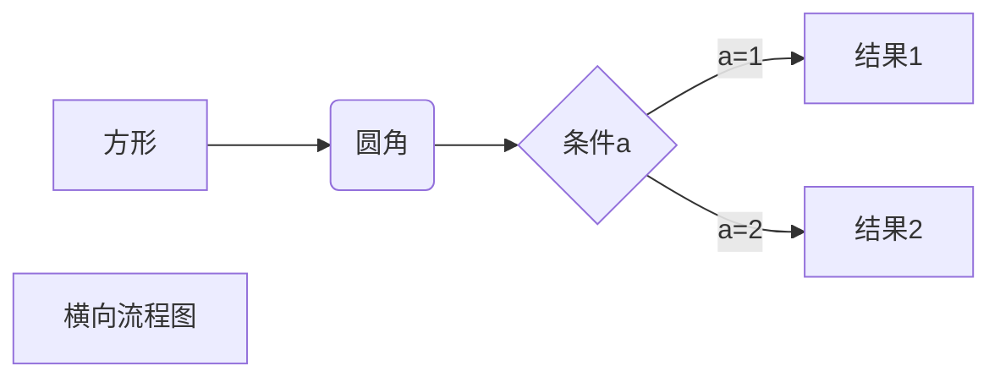

# 测试专用博客

本文章用于检测Github的同步功能是否正常工作。
文件的标题，内容，标签的生成效果。

## 能不能生成mermaid呢？

其实还想涉及一下mermaid……

```mermaid
graph LR
    A[方形] -->B(圆角)
    B --> C{条件a}
    C -->|a=1| D[结果1]
    C -->|a=2| E[结果2]
    F[横向流程图]
```